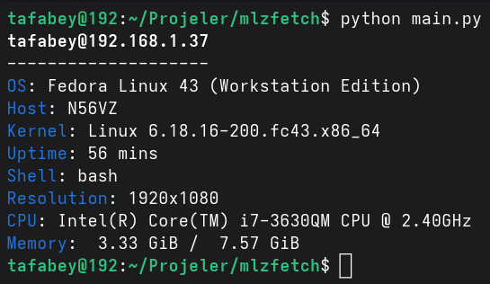

# mlzfetch
mlzfetch is a minimalist fetch tool for Linux. Written with Python programming language.

## Why mlzfetch?
I tested both fastfetch and mlzfetch in Fedora Linux with `time` utility and these are the results
|Tool|Real Time|User Time|Sys Time|
|---|---|---|---|
|fastfetch|77ms||55ms|23ms|
|mlzfetch|27ms|18ms|9ms|
So, mlzfetch is faster than fastfetch

## Example output


## How to install
- First, clone the repository
```bash
git clone https://github.com/tafabey/mlzfetch
```
- Then, enter the directory
```bash
cd mlzfetch
```
- Finally, type the install command
```
pip install .
```
- Now you can use the program by `mlzfetch` command

## Licensing
mlzfetch is licensed under the [BSD-3-Clause License](LICENSE)
